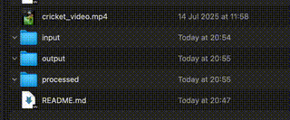

# Video to GIF Folder

  



This project provides a script (`convert_video_to_gif.sh`) designed to be used with macOS's Automator to automatically convert video files into animated GIFs when they are added to a specific folder.

## How It Works

The `convert_video_to_gif.sh` script is triggered by an Automator "Folder Action." When you drop a video file into the designated folder, the script:
1.  Converts the video to a GIF using `ffmpeg`.
2.  Places the resulting `.gif` file into an `output` folder.
3.  Moves the original video file into a `processed` folder to prevent reprocessing.
4.  Logs all its actions to a `conversion.log` file for easy debugging.

The folder structure is organized as follows:

- **`input/`**: This is the folder you will set up the Automator Folder Action on. Drop your videos here.
- **`output/`**: Converted `.gif` files are saved here.
- **`processed/`**: Original videos are moved here after successful conversion.
- **`conversion.log`**: A log file that records the script's activity.

## Prerequisites

You must have **FFmpeg** installed on your system. If you don't have it, you can install it using [Homebrew](https://brew.sh/):

```bash
brew install ffmpeg
```

## Setup Instructions

Follow these steps carefully to set up the automated conversion.

### 1. Configure the Script

Before setting up Automator, you need to ensure the script is correctly configured.

**A. Make the script executable:**
Open your terminal, navigate to the project directory, and run the following command:
```bash
chmod +x convert_video_to_gif.sh
```

**B. Verify the `ffmpeg` path:**
The script needs to know the exact location of the `ffmpeg` executable. The script has been pre-configured with the path `/opt/homebrew/bin/ffmpeg`, which is common for Homebrew on Apple Silicon Macs.

To confirm this is correct for your system, run `which ffmpeg` in your terminal. If the output is different, open `convert_video_to_gif.sh` and update the `FFMPEG_CMD` variable with the correct path.

### 2. Set Up the Automator Folder Action

1.  **Open Automator** (you can find it in your Applications folder or search with Spotlight).
2.  Create a new document by selecting **File > New**.
3.  Choose **Folder Action** as the document type.
4.  At the top of the workflow window, click the dropdown menu next to **"Folder Action receives files and folders added to"** and select **"Other..."**. Navigate to and choose the `input` folder within this project directory.
5.  In the **Actions** library on the left, find the **Run Shell Script** action and drag it into the workflow area on the right.
6.  In the **Run Shell Script** action box:
    *   Set the **"Pass input"** dropdown to **"as arguments"**.
    *   Paste the following code into the text area. **Make sure to replace `/path/to/your/project/` with the actual absolute path to this project's folder.**

    ```bash
    # The project directory must be an absolute path
    PROJECT_DIR="/path/to/your/project/video-to-gif-folder"

    # Loop through each file dropped onto the folder
    for f in "$@"
    do
        # Execute the conversion script, passing the file path as an argument
        "$PROJECT_DIR/convert_video_to_gif.sh" "$f"
    done
    ```
7.  **Save the Folder Action**. Give it a descriptive name, like "Video to GIF Converter".

### 3. Test the Setup

Your automated workflow is now active. To test it, simply drag and drop a video file into the `input` folder. Within a few moments, you should see:
- A new `.gif` file appear in the `output` folder.
- The original video file disappear from the `input` folder and appear in the `processed` folder.
- The `conversion.log` file will be updated with the details of the conversion.

## Testing the Script Manually

Before setting up the Automator action, you can test the script directly from your terminal to make sure it's working correctly. Navigate to the project directory and run:

```bash
./convert_video_to_gif.sh /path/to/your/video.mp4
```

This is a great way to troubleshoot any issues with `ffmpeg` or the script itself. Check the `conversion.log` for detailed output.

## Development Notes

This project was built with the help of the Gemini CLI (https://github.com/google-gemini/gemini-cli). If you need to modify the script, fix bugs, or add new features, you can use it for assistance.
